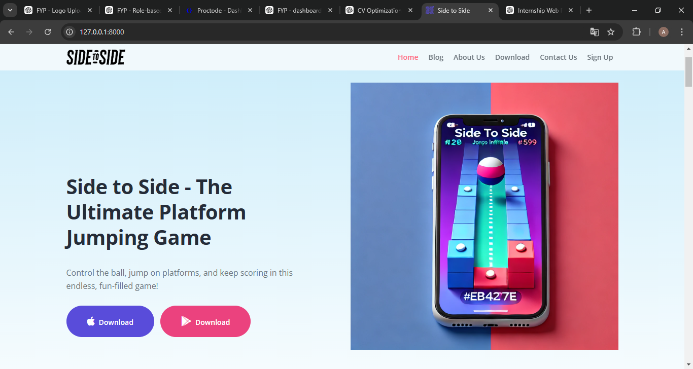
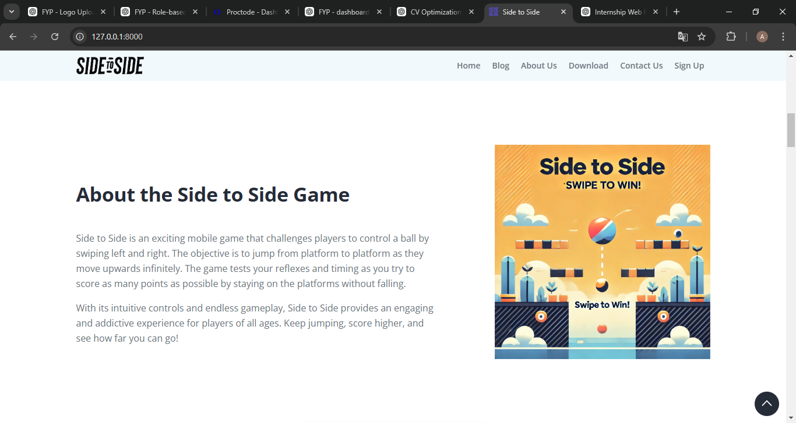
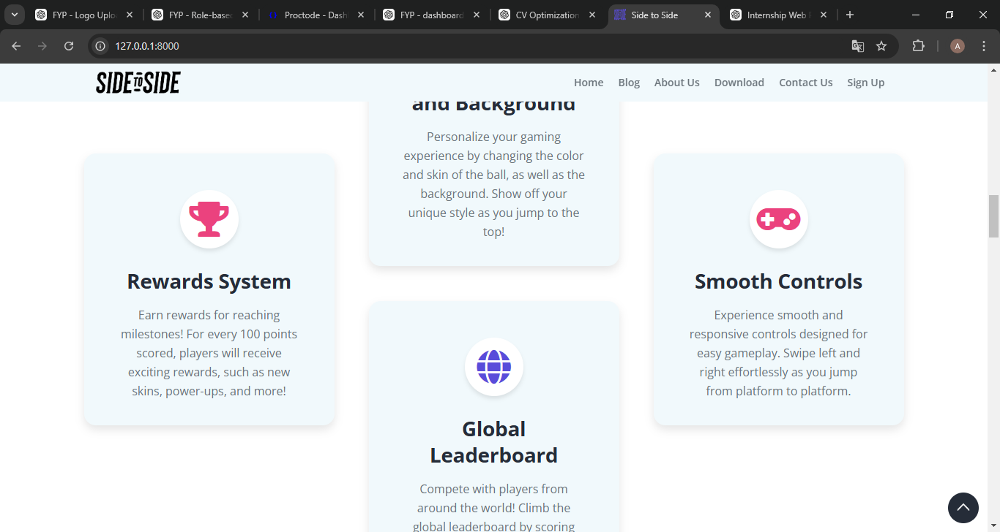
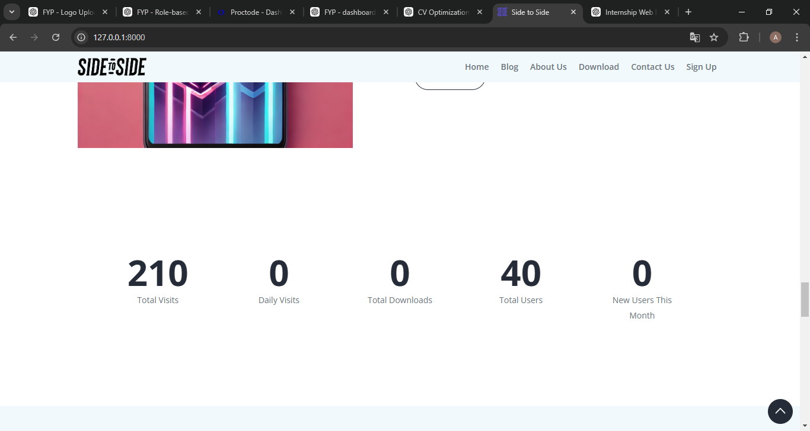
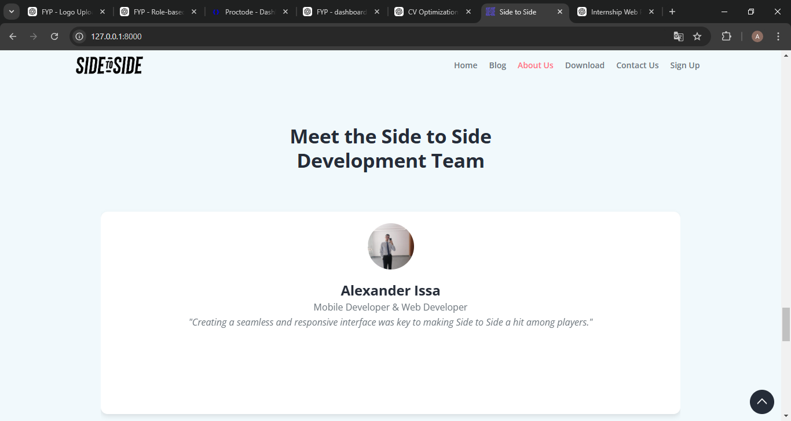
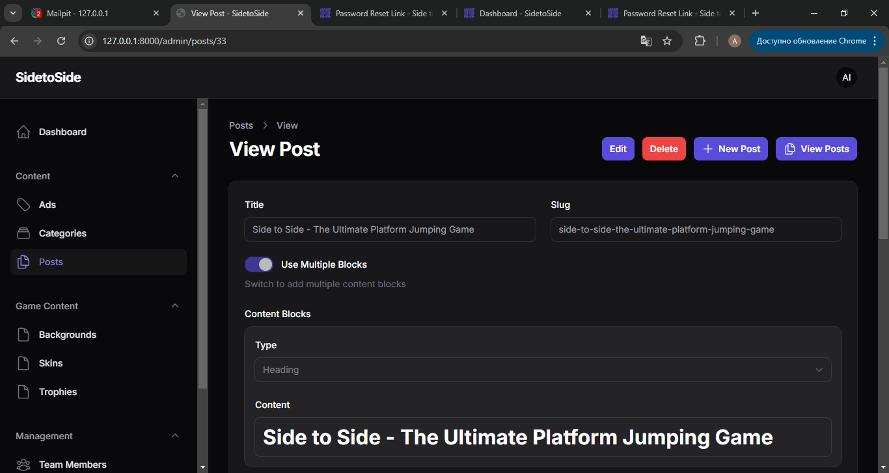

<p align="center"><a href="https://laravel.com" target="_blank"></a></p>

<p align="center">
<a href="https://github.com/laravel/framework/actions"></a>
<a href="https://packagist.org/packages/laravel/framework"></a>
<a href="https://packagist.org/packages/laravel/framework"></a>
<a href="https://packagist.org/packages/laravel/framework"></a>
</p>

# Side to Side Web Dashboard

## Overview
The "Side to Side" web dashboard is an administrative platform for managing game-related content, advertisements, user interactions, and statistics. It provides an intuitive interface for administrators to control and customize different aspects of the "Side to Side" game while ensuring smooth user engagement.

## Features

### 1. **User & Team Management**
- View and manage registered users.
- Add, edit, and remove team members.
- Assign roles and permissions.

### 2. **Content Management**
- Control and organize game-related content blocks.
- Manage blog posts, articles, and updates.
- Upload images and customize displayed content.

### 3. **Advertisements & Sponsorships**
- Create, manage, and display sponsored ads.
- Track ad performance and engagement.

### 4. **Game Features Control**
- Modify reward system settings.
- Manage leaderboard functionality.
- Customize skins, backgrounds, and trophies.

### 5. **Dashboard Statistics & Analytics**
- Monitor total visits, daily visits, and total downloads.
- Track the number of active users and new users per month.

### 6. **Post & Blog Management**
- Add and manage game-related posts.
- Edit and delete existing posts.
- View all published content.

## Technologies Used
- **Backend**: Laravel (PHP Framework)
- **Frontend**: HTML, CSS, JavaScript
- **Database**: MySQL
- **Version Control**: Git

## Installation Guide
### Prerequisites:
- PHP 8+
- Composer
- Node.js & NPM
- MySQL Database


## Screenshots
Below are some screenshots illustrating different sections of the dashboard:

```md







```

## Conclusion
This project provides a robust and scalable dashboard for managing various aspects of the "Side to Side" game, ensuring easy content customization, user engagement, and advertisement handling.

